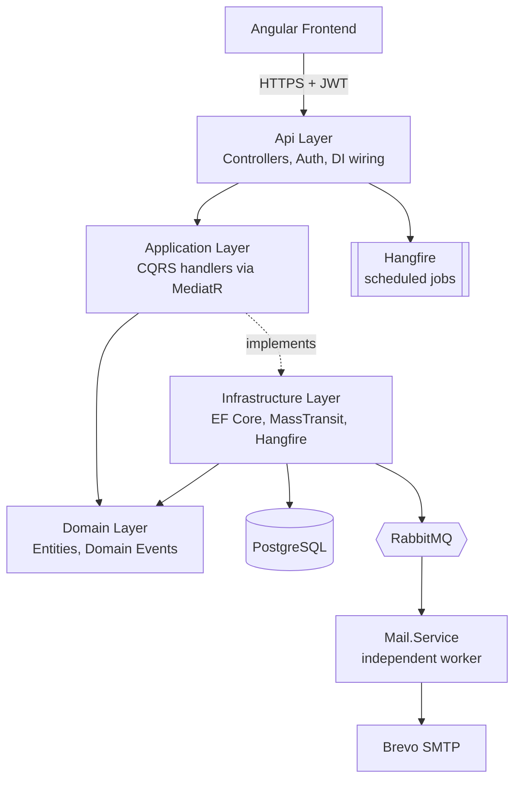
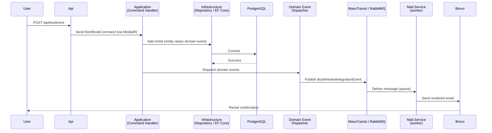

# Library Management System

A full-stack library management system — Angular frontend, ASP.NET Core backend — demonstrating production-grade architecture: Clean Architecture with CQRS via MediatR, a domain layer where entities own their own invariants and raise domain events, event-driven integrations across service boundaries, background job scheduling, and a containerized multi-service deployment.

Users can browse and rent books; admins manage the catalog and user base. Every meaningful action (registration, rentals, returns, due-date reminders) triggers a real transactional email, delivered through an independent worker service — not a mocked side-effect.

## Table of Contents

- [Features](#features)
- [Architecture](#architecture)
- [Tech Stack](#tech-stack)
- [Project Structure](#project-structure)
- [Getting Started](#getting-started)
- [Configuration](#configuration)
- [API Documentation](#api-documentation)

## Features

**For users**
- Registration and login with JWT authentication
- Browse and search the catalog (by title, author, genre, or ISBN), with server-side pagination
- Rent and return books, with a 30-day loan period
- View active rentals and due dates
- Automatic email notifications: welcome email on signup, rental confirmation, return confirmation, and a reminder a few days before a book is due

**For admins**
- Manage books, authors, and genres (add/edit/delete)
- View and manage all registered users, including each user's currently active rentals
- See who currently holds any given book from the catalog view
- Admin accounts aren't self-service — there's no registration flow that can grant admin access; accounts are provisioned directly, by design

## Architecture

The backend follows Clean Architecture, split across four projects with dependencies pointing strictly inward:



Domain and Application have no knowledge of EF Core, MassTransit, or ASP.NET Core — those are Infrastructure and Api concerns, wired together only at the composition root. Every write operation goes through a CQRS command handler; every read through a query handler; MediatR dispatches both.

### Event-driven email notifications

Rather than sending email synchronously inside request handlers (which would couple every write operation to SMTP availability and latency), domain events are raised on the entity, dispatched only *after* a successful database commit, and handled by a completely separate consumer process:



This means the API responds to the user immediately without waiting on an SMTP round-trip, a slow or unreachable mail provider never fails a rental request, and `Mail.Service` can be deployed, scaled, and redeployed completely independently of the API.

The due-soon reminder is the one exception to "events triggered by requests" — it's driven by a **Hangfire recurring job** running daily rather than a real-time trigger. The job checks for rentals due within a catch-up window (not an exact due-date match) specifically so that if the job's host is down when it would normally fire, the next run still catches the reminder rather than silently skipping it.

## Tech Stack

**Backend**
- .NET 10 / ASP.NET Core Web API
- Entity Framework Core + PostgreSQL (Npgsql)
- MediatR (CQRS)
- MassTransit + RabbitMQ (event bus)
- Hangfire (scheduled jobs, backed by PostgreSQL storage)
- MailKit (SMTP delivery)
- BCrypt.Net (password hashing)
- JWT Bearer authentication

**Frontend**
- Angular 22 (standalone components, no NgModules)
- Reactive Forms
- Role-based route guards (Admin / User / authenticated / unauthenticated)

**Infrastructure**
- Docker, with a separate Dockerfile per service (Api, Mail.Service, Frontend)
- nginx (serves the built Angular app and reverse-proxies API calls, so the browser only ever talks to a single origin)
- Docker Compose for local orchestration
- Brevo (transactional email delivery in real environments; MailHog for local dev)

## Project Structure

```
backend/LibraryManagementSystem/src/
├── Api/
│   ├── LibraryManagementSystem.Api             — Controllers, auth wiring, composition root
│   ├── LibraryManagementSystem.Application     — CQRS commands/queries, DTOs, no framework deps
│   ├── LibraryManagementSystem.Domain          — Entities, domain events, repository interfaces
│   └── LibraryManagementSystem.Infrastructure  — EF Core, repositories, MassTransit, Hangfire
└── Mail.Service/
    ├── LibraryManagementSystem.Contracts       — Integration event contracts (shared with Api)
    └── LibraryManagementSystem.MailService     — Independent worker: consumes events, sends email

frontend/library-management-system/            — Angular app

docker/
├── docker-compose.yml
└── .env                                        — not committed; see Configuration
```

## Getting Started

The entire stack runs via Docker Compose — no local .NET or Node installation required to run it (only to develop it).

**Prerequisites:** Docker Desktop, and a Brevo (or any SMTP provider) account if you want real email delivery — otherwise MailHog captures everything locally.

```bash
git clone https://github.com/MarkoKliska/LibraryManagementSystem.git
cd LibraryManagementSystem/docker
# create .env — see Configuration below
docker compose up -d --build
```

Once running:
- Frontend: http://localhost:8081
- API (direct): http://localhost:8080
- MailHog UI (local test inbox): http://localhost:8025
- RabbitMQ management: http://localhost:15672
- pgAdmin: http://localhost:5050

The API applies its own database migrations automatically on startup — no manual `dotnet ef database update` step needed.

## Configuration

Create `docker/.env` with:

```
DB_CONNECTION=Host=postgres;Database=LibraryDb;Username=admin;Password=admin123
JWT_KEY=<a long random string>
RABBITMQ_USER=guest
RABBITMQ_PASSWORD=guest
SMTP_HOST=smtp-relay.brevo.com
SMTP_PORT=587
SMTP_USERNAME=<your Brevo SMTP login>
SMTP_PASSWORD=<your Brevo SMTP key>
SMTP_FROM_ADDRESS=<a sender address verified in Brevo>
```

`.env` is git-ignored; nothing above is committed to the repo.

## API Documentation

Swagger UI is available at `/swagger` when the API runs in `Development` mode (disabled in the containerized `Production` build, consistent with not exposing API docs on a public deployment by default).
